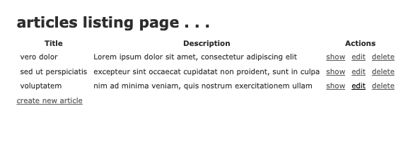

## Description
- simple ruby on rails web application to create, read, update, and destroy articles

### Installation
- The project is uploaded to [GitHub](https://github.com/) at the following repository: [here](https://github.com/sourslaw/ruby_articles_exercise)
- Deployed application may be seen: [here](https://secure-anchorage-90961.herokuapp.com/)
